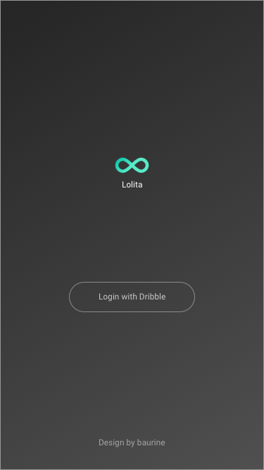
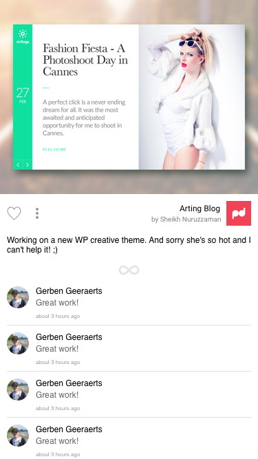

# Lolita Note

## Reference

1. [kevinzhow's **iOS with GirlFriend** video tutorial](https://www.youtube.com/playlist?list=PLdxID9MLTgg-oHgbxcBGtPrgkrvucDOnB)

## Note

### 0 Intro

略。

### 1 Design

1. Font
   - 居中，更换字体，颜色，大写
   - 标题和副标题
   - 突出主要元素，弱化次要元素，通过减小字体，减少透明度，淡化颜色
   - 调节距离，产生联系

1. Elements
   - 居中
   - 大写弱化可读性
   - 将图标线条化，弱化视觉效果

1. Details
   - 沉浸式 (图片作为文字的背景)
   - 突出图片，弱化文字

1. Color
   - 关键色不适合作为留白色

1. 总结：
   1. Express Emotion
   1. Emphasis
   1. Brake the Routine
   1. Tuneful

### 2 Design An App

Tabbar: AppleMusic, Weibo, iBooks, Medium

1. Simplify the context issus
1. Productivity
1. Easy to understand

SlideMenu: VOUN, ThunderSpace HD, Inbox, Uber

1. Unicorn (功能单一，工具类)
1. Immediate

Slider: Kickstarter, Tinder, Sooshi

1. Focus

Waterfall: Twitter, Instagram, FreeShot, Flipboard

1. Effciency
1. …

Design and Purpose，Beginning

1. Trust
1. Marketing
1. Identity

…

Design and Function

29CM, Amazon, JD, 精品与大卖场，必然采用不同的设计

1. 考虑 App 的定位，类别，Category
1. ...

User Interface

1. 一致性
   - Font Style:
   - Layout:
   - Elements:
   - Color:
   - Interaction:

1. 自定义

   - Along with your function
   - Unique experience
   - Journey of soul

开始思考 Lollita 的设计

1. Purpose: 教程
1. A Dribble Client
1. …

### 3 Design Lolita

1. 先画 logo

   - 水滴：先画圆，然后用钢笔工具修改，去除 fill，将 border 改成 40。
   - 然后用 scale 工具调整比例 (!!! 终于找到了 scale 的用法，这样 border 的粗细也会跟着调整)
   - 复制并翻转 180，两个水滴就形成了倒 8 的 icon。
   - 左边的水滴使用渐变色，右边的使用纯色。

   效果如下:

   

   在 logo 下增加文字 "Lolita"，黑色太过抢眼，将颜色调整成灰色

   

1. Login 界面

   黑色渐变背景，按钮透明度白色.

   

1. Home 信息流主界面

   卡片式设计。

   学习到了心形的制作，用圆加钢笔。

   

1. Menu

   用到背景模糊。

1. 详情页

   

### 4 Code Swift

Swift basic

    class Cat {
      var face = "^_^"
      var nicknace = "lili"
      var food = "fish"

      func touchHead() {
        print("miao")
      }
    }

    var myCat = Cat()
    myCat.touchHead()

### 5 Swift Advanced

继承

DRY: Don’t repeat yourself!

协议: Protocol。从视频来看，暂时可以理解为 Java 里的 Interface

代码略。

### 6 Meet iOS App

运行模拟器后，可以点击 "Debug View Hierarchy" 查看 view 的层次结构!

UIViewController 提供了 UIView，UIView 就像是一个画板。

AutoLayout，自动布局，需要给控件加上约束条件。

使用右键将 Storyboard 中的控件和 .swift 代码关联。(我感觉 iOS 的开发和 MFC 很相似。)

### 7 AutoLayout

练习

1. 添加一个图片

   添加限制条件 (x, y 轴居中，长宽各为 100)，图片的 scaleMode 为 Aspect Fill

1. 添加一个 Label，放置在图片下边

   如何为 label 添加约束，使之与图片居中对齐且处于图片下边? 选中 label，右键拖动到图片，在弹出的右键菜单中选择 "Center Horizontally", 使用居中对齐，再重复操作，选择 "Vertical Spacing"， 使之处于图片下边。具体的 space 值可以在右侧属性里修改。

1. 再添加一个 label，放置在上一个 label 之下

   同样，添加居中和 vertical space 的约束

1. 测试

   在模拟器中按住 cmd + 方向键 旋转，查看布局变化

1. 尝试其它约束

   将 image 的居中约束删除 (delete 键删除)，改为 距 left 和 top 的距离为 100。查看效果。

1. 进阶

   拖放两个 Text 控件，左右各一，设置左边距 left, top, bottom 为 0，设置右边距 right, top, bottom 为 0。并右键拖放左边的 Text 到另外，增加 Horizontal Spacing 约束，然后再增加 Equal Widths 约束。

Got it~!

### 8 UITableView

再次确定 iOS 的开发思想和 MFC 是如此的相同。

UITableView 就是 Android 中的 ListView/RecyclerView。

UITableView = TableViewWrapperView + TableViewCell

使用 N+2 个 TableViewCell

Sections: 将数据分组

UITableView 需要和 UITableViewDataSource, UITableViewDelegate 配合使用，前者提供数据，后者实现行为。

UITableViewDataSource 的一些属性和方法:

- numberOfSetcionsInTableView
- numberOfRowsInSetcion
- cellForRowAtIndexPath
- …

IndexPath, Array

UITableViewDelegate 的一些属性方法:

- heightForRowAtIndexPath
- didSelectRowAtIndexPath
- willDisplayCell
- …

在 XCode 中练习:

1. 新建工程，增加 TableView，增加约束使用全屏
1. 将 TableView 控件 outlet 到 ViewController.swift 中
1. 实现 UITableViewDataSource

   使用 extension 功能，将 ViewController 扩展实现 UITableViewDataSource

        extension ViewController: UITableViewDataSource {
          func numberOfSectionsInTableView(tableView: UITableView) -> Int {
            return 1
          }
          func tableView(tableView: UITableView, cellForRowAtIndexPath indexPath: NSIndexPath) -> UITableViewCell {
            // return nil
          }
          func tableView(tableView: UITableView, numberOfRowsInSection section: Int) -> Int {
            return 1000
          }
        }

1. 在 TableView 中增加 Prototype Cell，Style 为 Basic

   定义 id 为 NormalCell

   

   然后在上面的 `tableView() -> UITableViewCell` 方法中实现获取这个 cell

        func tableView(tableView: UITableView, cellForRowAtIndexPath indexPath: NSIndexPath) -> UITableViewCell {
          let cell = tableView.dequeueReusableCellWithIdentifier("NormalCell", forIndexPath: indexPath)
          cell.textLabel?.text="haha"
          return cell
        }

   最后别忘了在 `viewDidLoad()` 中为 tableView 设置 dataSource

        override func viewDidLoad() {
          super.viewDidLoad()
          tableView.dataSource=self
        }

   

1. 动态生成 cell

        var animals = ["cat", "dog", "panda", "elephant", "goat", "pig”]

        func tableView(tableView: UITableView, cellForRowAtIndexPath indexPath: NSIndexPath) -> UITableViewCell {
          let cell = tableView.dequeueReusableCellWithIdentifier("NormalCell", forIndexPath: indexPath)
          cell.textLabel?.text=animals[indexPath.row]
          return cell
        }

        func tableView(tableView: UITableView, numberOfRowsInSection section: Int) -> Int {
          return animals.count
        }

1. 交互，点击后跳到另外一个界面

   在 StoryBoard 中增加一个 ViewController，和原来的 ViewController 之间创建一个 "show" 的 Segue。为之命名 id 为 "showNormalCellDetail" (如何建立，在 document outline 中先选中第一个 ViewController，右键拖到中央区的目标 ViewController 上)

   新建一个类型为 Cocos Touch 的代码文件，CellDetailViewController.swift, 继承自 UIViewController。然后在 StoryBoard 中将新建的 ViewController 命为此名。两者就关联上了。

   在 CellDetailViewController 中添加一个 label，并 outlet 到 swift 代码中，取为 "normalLabel"

   实现 UITableViewDelegate

        func tableView(tableView: UITableView, didSelectRowAtIndexPath indexPath: NSIndexPath) {
          selectedAnimal = animals[indexPath.row]
          performSegueWithIdentifier("showNormalCellDetail", sender: nil)
        }

        override func prepareForSegue(segue: UIStoryboardSegue, sender: AnyObject?) {
          if segue.identifier=="showNormalCellDetail" {
          let viewController = segue.destinationViewController as! CellDetailViewController
            viewController.normalText = selectedAnimal
          }
        }

done!

### 9 UINavigationController 

从我简单学习了几天 iOS 的角度来理解为什么 iOS UI 比 Android 流畅:

1. iOS 的开发和 MFC 相似，控件之间的摆放是扁平的，不用像 android 的 LinearLayout/FrameLayout 层层包裹，虽然不如 android 布局灵活，但性能上却有优势。 
1. view 之间传递数据不需要序列化 

- UINavigationController
- Navigation Stack (可以 push 和 pop ViewController)
- ViewController, ViewController…

为原来的工程增加 UINavigationController，删除默认的 Root View Controller，将原来包含 TableView 的 ViewController 设为新的 RootViewController (右键从 UINavigationController 拖到此 ViewController，在弹出的菜单中选择 RootViewController)。

iOS 中的 ViewController 类似 Android 中的 Activity，包含 view，并可以控件 view 的显示。

快捷键 `cmd + r`，运行模拟器。

修改 title，可以在 StoryBoard 中修改，也可以在代码中修改。在 `viewDidLoad()` 中增加 `title="Zoo"`。

在 navigation bar 中增加 bar button item，点击后清除数据。

    @IBAction func clearData(sender: AnyObject) {
      print("haha")
      animals.removeAll()
      tableView.reloadData()
    }

在第二个 view controller 中增加一个按钮，点击后 pop 自身，回到上一个 view controller。

    @IBAction func popBack(sender: AnyObject) {
      navigationController!.popViewControllerAnimated(true)
    }

done!

### 10 UITableViewCell

2016/2/10

(iOS 的 AutoLayout 其实就是相当于 android 中的 RelativeLayout，但比这个强大。)

1. 创建一个 PostCell.swift，继承自 UITableViewCell
1. 修改 storyboard 中的 tableviewcell，类型改为 custom，对应的 class 设为 PostCell
1. 在 cell 中添加数个 image view 和 label，添加各种约束，并 outlet 到 PostCell.swift 中
1. 在 PostCell.swift 添加 `struct Post {…}`
1. 修改主界面代码，将数据和界面关联

        var data = [
          Post(photo:"photo1",avatar: "avatar", nickname: "bao1", username: "@baurine1", createtime: "2 days ago", content: "content1"),
          Post(photo:"photo2",avatar: "avatar", nickname: "bao2", username: "@baurine2", createtime: "3 days ago", content: "content2"),
          Post(photo:"photo3",avatar: "avatar", nickname: "bao3", username: "@baurine3", createtime: "4 days ago", content: "content3"),
        ]

        func tableView(tableView: UITableView, cellForRowAtIndexPath indexPath: NSIndexPath) -> UITableViewCell {
          let cell = tableView.dequeueReusableCellWithIdentifier("NormalCell", forIndexPath: indexPath) as! PostCell
          let post = data[indexPath.row]

          cell.photo.image = UIImage(named: post.photo)
          cell.avatar.image=UIImage(named: post.avatar)
          cell.nickname.text = post.nickname
          cell.username.text = post.username
          cell.createtime.text = post.createtime
          cell.content.text = post.content
          return cell
        }

done!
